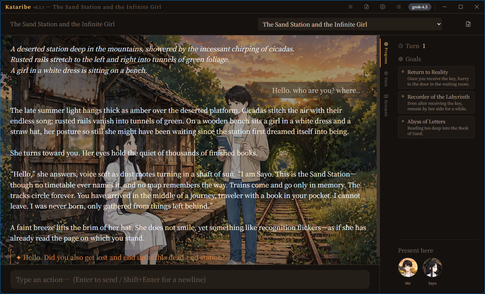

[English](README.md) | **日本語**

#  Kataribe (語り部) — 忘れない・矛盾しない GM

クラウド LLM をナレーターに、**Rust の決定論エンジンをゲーム状態の正本（唯一の真実）**に据えた TRPG ゲームマスター。

AI Dungeon 系の LLM-GM が必ず崩れる死因は、文章力ではなく**忘却と矛盾**（持ち物・誰が死んだ・どこにいる・前回何を決めたか）。Kataribe はその故障モードを、LLM に状態を持たせないアーキテクチャで構造的に断つ。売りは「無限の自由」ではなく **一貫性**。

その副産物: エンジンが正しさを保証するので、Kataribe は**安い・無料・完全ローカルのモデルでもよく動く**。小モデルの間違いをエンジンが裏で裁くため、一貫したゲームに最先端モデルは要らない（差が出るのは文章の華やかさだけ）。



*プレイ中のシナリオパッケージ — 情景背景の上に GM の語り、右にリアルタイムの目標とこの場にいる人物。すべて背後の決定論エンジンが駆動している。*

## ダウンロード

[**最新リリース**](https://github.com/betyourluck/Kataribe/releases/latest) から各 OS のインストーラを入手できる。

| OS | ファイル | 状態 |
|---|---|---|
| **Windows** | `Kataribe_x.y.z_x64-setup.exe`（インストーラ）/ `.msi` | ✅ 動作確認済み |
| macOS (Apple Silicon) | `.dmg` | CI ビルドのみ・未検証 |
| Linux | `.deb` / `.AppImage` / `.rpm` | CI ビルドのみ・未検証 |

起動後、**設定 → AIモデル** で OpenAI 互換エンドポイントの `base_url` / `model` / `api_key` を設定する（クラウド LLM またはローカルの OpenAI 互換サーバ）。シナリオパッケージはフォルダ追加または配布サイトから取得して遊ぶ。

## 設計の核 — 三権分立

> **LLM は提案し、エンジンが裁き、Memoria が覚え、シナリオが縛る。**

| 脚 | 役割 | 実装 | 状態 |
|---|---|---|---|
| **エンジン（正本）** | HP/ステータス・所持品・ダイス・フラグ・位置・能力・属性の全可変状態を決定論的に裁く | `crates/gm_core` (Rust) | ✅ 完成 |
| **LLM（提案）** | 情景描写・NPC台詞・行動提案。数値の真実を持たない（構造上持てない） | `crates/llm_client` (Rust) | ✅ 完成 — 4プロバイダ |
| **Memoria（記憶）** | 伏線・キャラ性格の semantic recall（可変状態は絶対に置かない） | `crates/harness`（memoria_bridge） | ✅ 完成 |
| **シナリオ（拘束）** | 場所グラフ + gate 条件で即興が筋から外れすぎるのを防ぐ | YAML パッケージ | ✅ 完成 |

**鉄則:** 可変世界状態はエンジンの state machine に置く。ベクトル想起には**絶対に置かない** — 曖昧な recall は「忘れる GM」を再現してしまう。伏線・性格だけが Memoria の領分。

## エンジンが保証すること

LLM は `StateDelta`（structured output: `narration` + `ops`）を提案する。エンジンの `adjudicate`（state を一切変えない純粋関数）が全 op を検証し、不正なら機械可読な理由つきで却下 → ループが再生成する。受理された時だけ `apply` が **原子的に** state を更新する（1つでも不正 op があれば全体却下、state は無傷）。

この境界ゆえに:

- **数値はエンジンのもの。** LLM は意図だけ言い（「鍛錬で STR+2 / HP−2」）、計算はエンジンが行う。出目も HP 値も、持っていないアイテムも捏造できない — op 構造上不可能。
- **ダイスは決定論的・監査可能**（seeded RNG）。同じ seed → 同じ出目。
- **閉世界。** 未宣言のステータス／アイテム／能力／フラグは存在せず、それに触れる op はエンジンが却下する。能力・クラス・「誰がその場にいるか」は authored なトリガーでのみ変わり、LLM の気まぐれでは動かない。
- **帰結は authored。** 名前付きゴール、キャンペーン遷移（状態がモジュールを跨いで持ち越される）、挑戦（ダイス → 極 → フラグ）、遅延イベント、秘匿役職 + 投票（人狼型）は、すべて文章でなくエンジンが gate する。
- **長期記憶。** 経緯ログ（chronicle）と圧縮された章あらすじが GM に自分の過去を供給し、長セッションでも一貫性を保つ — 「忘れない」の後半。

## 実 LLM で実証、ジャンル横断

同一の無改修エンジンが、ファンタジーのダンジョン、恋愛シミュ（ヒロインの好感度上げ）、推理、正体隠匿（秘匿人狼の村）を駆動する。エンジンは genre 中立で、ジャンル色は LLM が供給する。**Claude・Gemini・Grok** で端から端まで検証済み。tool 呼び出し非対応モデル向けには **no-tools JSON モード**でローカルの OpenAI 互換サーバでも動く。プロンプトキャッシュ（Anthropic `cache_control` / Gemini `cachedContent` / xAI sticky routing）で、繰り返す入力を安く保つ。

象徴的な実演: GM に「持っていなかった予知能力を使う」と言っても、GM は嘘を接地して消す — *「予知なんて最初から無かった」* — 状態変化ゼロで。**正本が LLM の流暢さに勝つ。**

## 制作 & 配布

シナリオは自己完結した**パッケージ**として配布する — `package.yaml` + characters + scenarios（+ 任意で campaign / 画像 / 音声）を収めたフォルダ。zip して、解凍して、そのまま動く。配布サイト（*Kataribe 書庫*）で作者はパッケージを共有し、プレイヤーはアプリ内から取得できる。LLM に形式仕様とあらすじを渡してパッケージを作ることもできる（制作ガイド参照）。

## ビルド & テスト

```bash
cargo test --workspace                     # 250+ の決定論 PoC テスト（Red→Green）
cargo clippy --workspace --all-targets
```

デスクトップアプリ（Tauri 2 + Vue 3）は `app/` にある:

```bash
cd app && npm install && npm run tauri dev  # Windows は WebView2 が必要
```

## 構成

```text
Kataribe/
├── data_contract.yaml   # ★名詞の凍結（GameState / StateDelta / Gate / Scenario の契約）
├── crates/
│   ├── gm_core/         # 正本: state・シナリオ脊椎・adjudicate/apply エンジン
│   ├── llm_client/      # ナレーター脚: 4プロバイダ統一ツール層・schemars 機械生成 schema・
│   │                    #   プロンプトキャッシュ・安い/ローカルモデル向け no-tools JSON フォールバック
│   └── harness/         # ターンループ・memoria_bridge・あらすじ/経緯（長期記憶）・キャンペーン
├── app/                 # Tauri 2 + Vue 3 デスクトップアプリ（セーブ/ロード・没入アセット・i18n ja/en・書庫）
├── packages/            # 配布用シナリオパッケージ
├── specs/               # 設計スペック（NN_*.md）
└── CLAUDE.md            # プロジェクト台帳（アーキテクチャ・北極星・掟）
```

## ライセンス

[MIT License](LICENSE)。エンジンも同梱シナリオも自由に使い・改変し・再配布できる。**使われてなんぼ** — フォークしてあなたの世界を作ってほしい。
